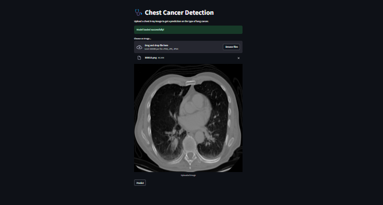

# 🩺 Chest Cancer Detection with Streamlit

Welcome to the **Chest Cancer Detection** project! This repository hosts a Streamlit web application designed to identify various types of lung cancer from chest X-ray images using a deep learning model.

## 🌟 Project Overview

Our application utilizes a pre-trained `InceptionV3` model to provide predictions on uploaded chest X-ray images. This tool aims to assist in the early detection of lung cancer, enhancing diagnostic efficiency and accuracy.

### Key Features

- **Real-Time Prediction**: Upload an X-ray image and receive instant predictions.
- **User-Friendly Interface**: Simple and intuitive design for seamless interaction.
- **Model Integration**: Uses advanced deep learning techniques for accurate results.



## 🚀 Getting Started

To get a copy of this project up and running on your local machine, follow these steps.

### Prerequisites

- Python 3.7 or higher
- Git
- Git Large File Storage (LFS)

### Installation Steps

1. **Clone the Repository**

   Open your terminal or command prompt and run:

   ```bash
   git clone https://github.com/amitkumar2308/Cancer-detection-streamlit.git
   cd Cancer-detection-streamlit

2. **Setup Virtual Environment**
     ```bash
        python -m venv .venv
        source .venv/bin/activate  # On Windows use .venv\Scripts\activate

3. **Install Dependencies**
   ```bash
    pip install -r requirements.txt


4. **For Uploading Large files** 
   ```bash
   Use Git LFS

5. **Run the application** 
    ```bash
    streamlit run model.py


🖼️ How It Works

1. **Upload an Image**

   Click on the "Choose an image..." button to select a chest X-ray image in .png, .jpg, or .jpeg format.

2. **Receive Predictions**

   Click "Predict" to analyze the image. The application will display the predicted type of lung cancer and provide confidence levels.

### Example

- **Image Upload**: 
  [Include image upload example here]
- **Prediction Result**: 
  [Include prediction result example here]

🤝 Contributing

We welcome contributions to improve this project. To contribute:

1. Fork the repository.
2. Create a new branch (`git checkout -b feature-branch`).
3. Make your changes.
4. Commit your changes (`git commit -am 'Add new feature'`).
5. Push to the branch (`git push origin feature-branch`).
6. Create a Pull Request.

🧑‍💻 Development Guidelines

- Use `black` for code formatting.
- Write tests for new features.
- Ensure code is well-documented.

📜 License

This project is licensed under the MIT License. See the LICENSE file for details.

📞 Contact

For questions or feedback, please contact:

- **Name**: Amit Kumar
- **Email**: amitkumar@example.com
- **GitHub**: amitkumar2308


  

