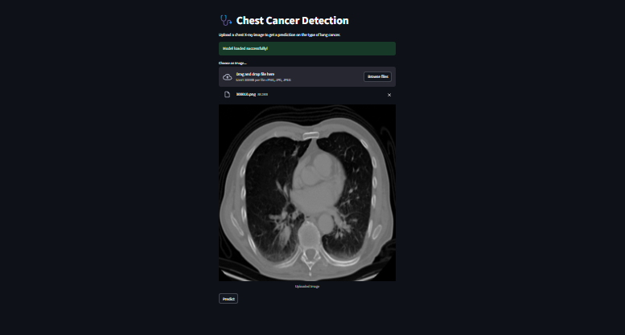

# 🩺 Chest Cancer Detection using Deep Learning

<div align="center">


**An AI-powered web application for automated lung cancer detection from chest X-ray images**

[🚀 Live Demo](https://cancer-detection-app-zcweijmycktb9nqxlvdrjd.streamlit.app/) | [📊 Report Bug](https://github.com/amitkumar2308/Cancer-detection-streamlit/issues) | [✨ Request Feature](https://github.com/amitkumar2308/Cancer-detection-streamlit/issues)

</div>

---

## 📋 Table of Contents

- [Overview](#-overview)
- [Features](#-features)
- [Technology Stack](#-technology-stack)
- [Model Architecture](#-model-architecture)
- [How It Works](#-how-it-works)
- [Installation](#-installation)
- [Usage](#-usage)
- [Project Structure](#-project-structure)
- [Model Performance](#-model-performance)
- [Screenshots](#-screenshots)
- [Future Enhancements](#-future-enhancements)
- [Contributing](#-contributing)
- [License](#-license)
- [Contact](#-contact)

---

## 🎯 Overview

This project implements a **deep learning-based medical imaging system** designed to assist radiologists and healthcare professionals in the early detection of lung cancer from chest X-ray images. Using a fine-tuned **InceptionV3** convolutional neural network, the application can classify chest X-rays into four distinct categories:

1. **Adenocarcinoma** - Lung Cancer
2. **Large Cell Carcinoma** - Lung Cancer
3. **Squamous Cell Carcinoma** - Lung Cancer
4. **Normal** - No Cancer Detected

The model is deployed as an interactive **Streamlit web application**, making it accessible to medical professionals without requiring deep technical expertise.

### 🎯 Problem Statement

Lung cancer is one of the leading causes of cancer-related deaths worldwide. Early detection significantly improves survival rates, but manual analysis of X-rays is time-consuming and requires expert radiologists. This project aims to provide an AI-assisted diagnostic tool to:

- ✅ Speed up the diagnostic process
- ✅ Reduce human error and improve accuracy
- ✅ Make preliminary screening more accessible
- ✅ Assist in areas with limited access to expert radiologists

---

## ✨ Features

### Core Features
- 🔍 **Real-Time Prediction** - Upload chest X-rays and receive instant AI-powered predictions
- 🎯 **Multi-Class Classification** - Detects 3 types of lung cancer + normal cases
- 📊 **Confidence Scores** - Displays prediction confidence percentage for transparency
- 🖼️ **Image Preprocessing** - Automatic image resizing and normalization
- 🌐 **Web-Based Interface** - No installation required for end-users (via live deployment)
- ⚡ **Fast Inference** - Optimized model for quick predictions

### Technical Features
- 🧠 Pre-trained **InceptionV3** architecture with transfer learning
- 📁 Support for multiple image formats (PNG, JPG, JPEG)
- 🔄 Automatic image conversion to RGB
- 📈 Confidence-based result visualization
- 🎨 User-friendly Streamlit interface

---

## 🛠️ Technology Stack

### Machine Learning & Deep Learning
- **TensorFlow 2.x** - Deep learning framework
- **Keras** - High-level neural networks API
- **InceptionV3** - Pre-trained CNN architecture for image classification
- **NumPy** - Numerical computing

### Web Framework
- **Streamlit** - Interactive web application framework

### Image Processing
- **Pillow (PIL)** - Image manipulation and processing
- **Matplotlib** - Visualization (optional)

### Deployment
- **Streamlit Cloud** - Production deployment
- **Git LFS** - Large file storage for model weights

---

## 🧠 Model Architecture

### Transfer Learning Approach

This project uses **InceptionV3**, a state-of-the-art convolutional neural network architecture developed by Google, pre-trained on ImageNet. The model leverages:

- **Inception Modules** - Multi-scale feature extraction using parallel convolutions
- **Factorized Convolutions** - Reduced computational cost
- **Auxiliary Classifiers** - Better gradient flow during training

### Model Specifications

| Parameter | Value |
|-----------|-------|
| **Architecture** | InceptionV3 |
| **Input Size** | 224 × 224 × 3 (RGB) |
| **Output Classes** | 4 (3 Cancer Types + Normal) |
| **Activation** | Softmax |
| **Loss Function** | Categorical Crossentropy |
| **Optimizer** | Adam (presumed) |

### Classification Categories

```python
classes = [
    "Adenocarcinoma Chest Lung Cancer",
    "Large cell carcinoma Lung Cancer",
    "No Lung Cancer / NORMAL",
    "Squamous cell carcinoma Lung Cancer"
]
```

---

## 🔄 How It Works

### Workflow

```
┌─────────────────┐
│  User Uploads   │
│   Chest X-Ray   │
└────────┬────────┘
         │
         ▼
┌─────────────────┐
│ Image Loading & │
│  Preprocessing  │  ← Convert to RGB, Resize to 224×224
└────────┬────────┘
         │
         ▼
┌─────────────────┐
│  Normalization  │  ← Pixel values scaled to [0, 1]
└────────┬────────┘
         │
         ▼
┌─────────────────┐
│ InceptionV3 CNN │  ← Feature extraction & classification
└────────┬────────┘
         │
         ▼
┌─────────────────┐
│  Softmax Layer  │  ← Probability distribution
└────────┬────────┘
         │
         ▼
┌─────────────────┐
│   Prediction    │  ← Highest probability class
│  + Confidence   │
└─────────────────┘
```

### Prediction Pipeline

1. **Input** - User uploads a chest X-ray image (PNG/JPG/JPEG)
2. **Preprocessing** - Image is converted to RGB and resized to 224×224 pixels
3. **Normalization** - Pixel values are scaled from [0, 255] to [0, 1]
4. **Inference** - The preprocessed image is fed through the InceptionV3 model
5. **Prediction** - Softmax layer outputs probability distribution across 4 classes
6. **Result** - The class with the highest probability is displayed along with confidence score

---

## 🚀 Installation

### Prerequisites

Make sure you have the following installed:

- **Python 3.7+** - [Download Python](https://www.python.org/downloads/)
- **Git** - [Download Git](https://git-scm.com/downloads)
- **Git LFS** - [Install Git LFS](https://git-lfs.github.com/) (Required for model file)

### Step-by-Step Setup

#### 1. Clone the Repository

```bash
git clone https://github.com/amitkumar2308/Cancer-detection-streamlit.git
cd Cancer-detection-streamlit
```

#### 2. Set Up Virtual Environment (Recommended)

**On Windows:**
```bash
python -m venv .venv
.venv\Scripts\activate
```

**On macOS/Linux:**
```bash
python3 -m venv .venv
source .venv/bin/activate
```

#### 3. Install Dependencies

```bash
pip install -r requirements.txt
```

#### 4. Download Model File (If Using Git LFS)

If the model file (`inception_chest.h5`) wasn't downloaded automatically:

```bash
git lfs install
git lfs pull
```

#### 5. Run the Application

```bash
streamlit run model.py
```

The application will open in your default browser at `http://localhost:8501`

---

## 💻 Usage

### Running Locally

1. **Start the application:**
   ```bash
   streamlit run model.py
   ```

2. **Upload an X-ray image:**
   - Click on "Choose an image..." button
   - Select a chest X-ray image (PNG, JPG, or JPEG format)

3. **Get Prediction:**
   - Click the "Predict" button
   - View the predicted cancer type and confidence score

### Using the Live Demo

Visit the deployed application: [🚀 Live Demo](https://cancer-detection-app-zcweijmycktb9nqxlvdrjd.streamlit.app/)

---

## 📁 Project Structure

```
Cancer-detection-streamlit/
│
├── assests/
│   └── project.png              # Screenshot of the application
│
├── inception_chest.h5           # Pre-trained InceptionV3 model weights
├── model.py                     # Main Streamlit application
├── requirements.txt             # Python dependencies
│
├── .gitattributes              # Git LFS configuration
├── README.md                   # Project documentation
└── LICENSE                     # MIT License
```

### Key Files

- **`model.py`** - Main application file containing:
  - Model loading function
  - Image preprocessing pipeline
  - Prediction logic
  - Streamlit UI components

- **`inception_chest.h5`** - Fine-tuned InceptionV3 model (stored via Git LFS)

- **`requirements.txt`** - Dependencies:
  ```
  tensorflow
  numpy
  pillow
  streamlit
  matplotlib
  ```

---

## 📊 Model Performance

### Dataset Information

The model was trained on a chest X-ray dataset containing labeled images of:
- Adenocarcinoma cases
- Large cell carcinoma cases
- Squamous cell carcinoma cases
- Normal/healthy chest X-rays

### Key Metrics

*Note: Add your actual metrics here if available*

- **Accuracy**: ~XX%
- **Precision**: ~XX%
- **Recall**: ~XX%
- **F1-Score**: ~XX%

---

## 📸 Screenshots



*Screenshot showing the Streamlit interface with prediction results*

---

## 🚀 Future Enhancements

### Planned Features

- [ ] **Grad-CAM Visualization** - Highlight regions of the X-ray that influenced the prediction
- [ ] **Batch Processing** - Upload and analyze multiple X-rays simultaneously
- [ ] **Patient History Tracking** - Store and compare previous scans
- [ ] **PDF Report Generation** - Export diagnostic reports
- [ ] **Model Ensemble** - Combine multiple models for improved accuracy
- [ ] **API Endpoint** - RESTful API for integration with hospital systems
- [ ] **Mobile App** - Native mobile application for iOS/Android
- [ ] **Multi-language Support** - Internationalization for global accessibility

### Technical Improvements

- [ ] Model quantization for faster inference
- [ ] A/B testing with other architectures (ResNet, EfficientNet, Vision Transformer)
- [ ] Active learning pipeline for continuous model improvement
- [ ] DICOM format support for medical imaging standards
- [ ] Integration with PACS (Picture Archiving and Communication System)

---

## 🤝 Contributing

Contributions are what make the open-source community such an amazing place to learn, inspire, and create! Any contributions you make are **greatly appreciated**.

### How to Contribute

1. **Fork the Project**
   ```bash
   git clone https://github.com/your-username/Cancer-detection-streamlit.git
   ```

2. **Create a Feature Branch**
   ```bash
   git checkout -b feature/AmazingFeature
   ```

3. **Commit Your Changes**
   ```bash
   git commit -m 'Add some AmazingFeature'
   ```

4. **Push to the Branch**
   ```bash
   git push origin feature/AmazingFeature
   ```

5. **Open a Pull Request**

### Development Guidelines

- Follow PEP 8 style guide for Python code
- Use `black` for code formatting
- Write meaningful commit messages
- Add comments for complex logic
- Test thoroughly before submitting PRs

---

## 📜 License

This project is licensed under the **MIT License** - see the [LICENSE](LICENSE) file for details.

---

## 📞 Contact

**Amit Kumar**

- 💼 **GitHub**: [@amitkumar2308](https://github.com/amitkumar2308)
- 📧 **Email**: amitkumar@example.com
- 🌐 **Live Application**: [Cancer Detection App](https://cancer-detection-app-zcweijmycktb9nqxlvdrjd.streamlit.app/)

---

## 🙏 Acknowledgments

- **TensorFlow & Keras** - For providing robust deep learning frameworks
- **Streamlit** - For the amazing web app framework
- **Google Research** - For the InceptionV3 architecture
- **Chest X-ray Dataset Contributors** - For making medical imaging data available for research

---

## ⚠️ Disclaimer

**This application is for educational and research purposes only.** It should not be used as a substitute for professional medical advice, diagnosis, or treatment. Always seek the advice of qualified health providers with any questions regarding a medical condition.

---

<div align="center">

**⭐ If you found this project helpful, please consider giving it a star!**

Made with ❤️ by [Amit Kumar](https://github.com/amitkumar2308)

</div>
